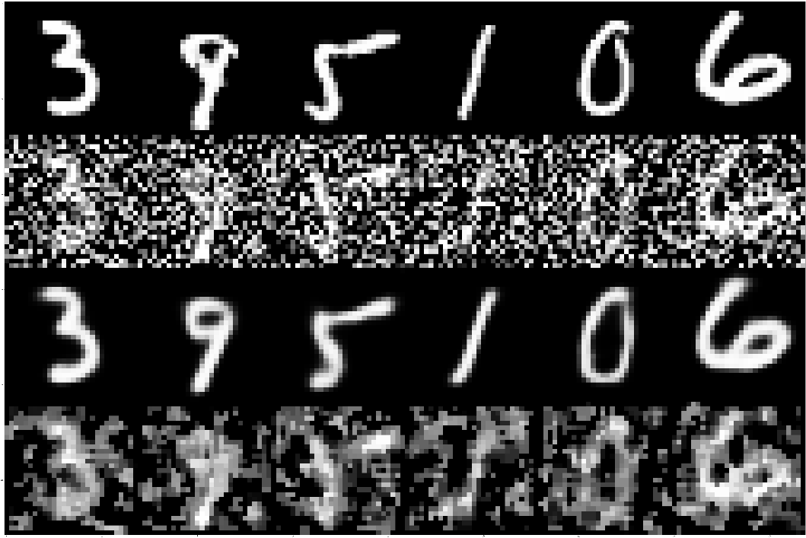

# Denoise-VAE
Deep convolutional autoencoder and variational autoencoder.

Denoise-VAE-keras.ipynb use keras with tensorflow backend, it is a variational autoencoder model.

Denoise-AE-tf.ipynb use tensorflow, it is an autoencoder model.

# Results


The six pictures in first row are the original pictures.

The second are the noised pictures with random noises.

The third are the results of the Denoise-AE-tf.ipynb

The forth are the results of median filtering, which is relized by the scipy.signal.
# Usage
```
git clone https://github.com/block98k/Denoise-VAE.git
cd ./Denoise-VAE
jupyter notebook Denoise-AE-tf.ipynb
```

# Prerequisites
**tensorflow** 1.0 or above

**numpy**

**scipy**

**jupyter**

# Acknowledgement
This is a project I used to practice autoencoder.
